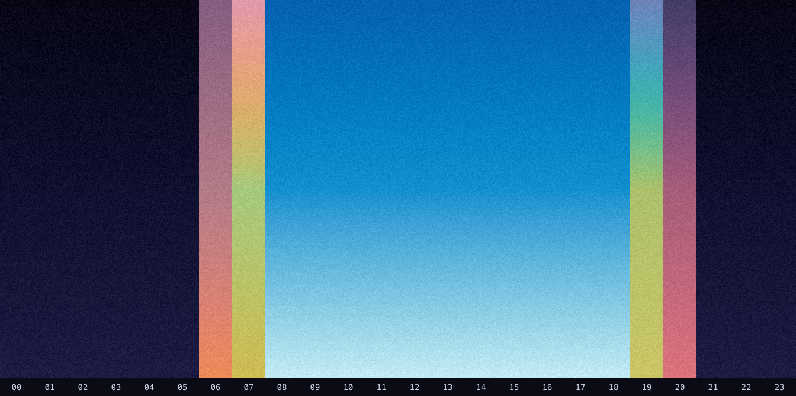

# SLOP NOTICE: In case you couldn't tell, this is slop

# time-bg

A serverless endpoint that renders a sky-coloured radial gradient for the
current time of day at a given location. Colours track the sun: night, dawn,
sunrise, day, sunset and dusk, blended perceptually in OKLab with a warm glow
radiating from the horizon and a layer of film grain.

## Day cycle

24 vertical slices, one per hour of a representative day (sunrise 06:30,
sunset 19:30). Regenerate with the preview script below.



## Usage

```
GET https://time-bg.vercel.app/api/sky?location=Waterloo+Ontario&format=png&width=1920&height=1080
```

| Param      | Default            | Notes                          |
| ---------- | ------------------ | ------------------------------ |
| `location` | `Waterloo+Ontario` | Passed to wttr.in              |
| `format`   | `png`              | `png` or `svg`                 |
| `width`    | `1920`             | Output width in px             |
| `height`   | `1080`             | Output height in px            |

Sun times come from [wttr.in](https://wttr.in); on failure the endpoint falls
back to a clear-day gradient.

## How it works

- `lib/constants.ts` — the per-phase palettes (`core`/`mid`/`edge`), sampled
  from sunset reference studies.
- `lib/sky-color.ts` — picks and blends phases for the current time. The warm
  sunrise/sunset window is a fixed 90 minutes on each side of the event.
- `lib/color.ts` — OKLab perceptual colour mixing (via [culori](https://culorijs.org)).
- `lib/image.ts` — radial gradient + grain rendering (PNG and SVG).

## Development

```sh
vp install

# regenerate the day-cycle preview (assets/day-cycle.png)
vp dlx esbuild scripts/preview.ts --bundle --platform=node --format=esm \
  --external:sharp --outfile=scripts/.preview.mjs && node scripts/.preview.mjs

# render a full sheet of phases / day-walk / sRGB-vs-OKLCH to /tmp for eyeballing
vp dlx esbuild scripts/render-test.ts --bundle --platform=node --format=esm \
  --external:sharp --outfile=scripts/.render.mjs && node scripts/.render.mjs
```
